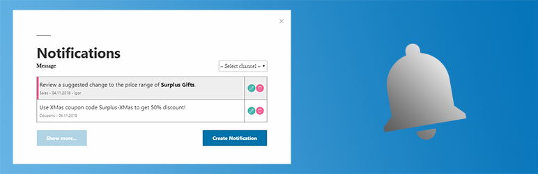

# WordPress Plugin Notification System

Notification System plugin creates and maintains a notification system for users on WordPress site.

## Features

Notification System plugin creates and maintains a notification system for users on WordPress site.

The plugin has the Options page in the site console, with relevant buttons and controls. Please see screenshots.



## Backend

Notifications are custom posts of type notification. There is a standard custom post interface, with a menu in admin.

Administrator can create, edit, and delete notifications. One taxonomy is available: Channel. Administrator is able to add, edit, and delete taxonomy terms. To restrict notification to some users, add user logins as a comma-separated list.

## Frontend

Plugin creates page /notifications "on the fly" — it does not exist in the database. Information on this page is visible only to the logged-in users (restricted by permissions in REST API Controller).

Plugin creates a popup window if url contains hash #notifications, like that: `http://my.site.org/some-url#notifications`. This is an easy way to show a popup window with notifications from anywhere. Just create a link like `<a href="http://my.site.org#notifications">Notifications</a>` and a click on this link will open a popup window with notifications.

Logged-in users can list notifications and filter them by a channel.

Show more button provides pagination of the notification list.

For those users who have the capability 'edit_posts', additional buttons are shown: Create, Update, and Delete. Popup windows provide relevant inputs.

## Site administrators

Add a custom link to the menu, with `#notifications` url. Use any navigation label or space(s) for empty label. Save menu. On the site frontend, you will see a new menu item with icon and unread count. By clicking on this menu item, a popup window with notifications will be opened.

= Developers =

Create an element(s) with the class `unread-notifications-count`. The best place for such element(s) is somewhere in the header or menu. It(they) can be updated by plugin during custom JS event `update_unread_counts`. Example:

    const count = 5;
    document.dispatchEvent(
        new CustomEvent(
            'update_unread_counts',
            { 'detail': count }
        )
    );

From php code, count element(s) for current user can be updated using 'update_unread_counts' action. Example:

    do_action( 'update_unread_counts' );

## Translation-ready

The plugin is prepared for translation. All strings are output via gettext functions. There is a .pot file in /language directory with strings collected.

## Code

php code conforms to php 5.6 level.
js code conforms to ES6 level.

All code is checked by php Code Sniffer, and conforms to WordPress Coding Standards.

## Installation

```
git clone https://github.com/kagg-design/notification-system
cd notification-system
composer install --no-dev
cd src
yarn
yarn run build:prod
```

## Development

```
git clone https://github.com/kagg-design/notification-system
cd notification-system
composer install
cd src
yarn
yarn run build:dev
```

## Recommended Tools

### i18n Tools

The WordPress Plugin Notification System uses a variable to store the text domain used when internationalizing strings throughout the KAGG Notifications. To take advantage of this method, there are tools that are recommended for providing correct, translatable files:

* [Poedit](https://poedit.net/)
* [makepot](http://i18n.svn.wordpress.org/tools/trunk/)
* [i18n](https://github.com/grappler/i18n)

Any of the above tools should provide you with the proper tooling to internationalize the plugin.

## License

The WordPress Plugin Notification System is licensed under the GPL v2 or later.

> This program is free software; you can redistribute it and/or modify it under the terms of the GNU General Public License, version 2, as published by the Free Software Foundation.

> This program is distributed in the hope that it will be useful, but WITHOUT ANY WARRANTY; without even the implied warranty of MERCHANTABILITY or FITNESS FOR A PARTICULAR PURPOSE. See the GNU General Public License for more details.

> You should have received a copy of the GNU General Public License along with this program; if not, write to the Free Software Foundation, Inc., 51-Franklin St, Fifth Floor, Boston, MA 02110-1301 USA

A copy of the license is included in the root of the plugin’s directory. The file name is `LICENSE`.

## Important Notes

### Licensing

The WordPress Plugin Notification System is licensed under the GPL v2 or later; however, if you opt to use third-party code that is not compatible with v2, then you may need to switch to using code that is GPL v3 compatible.

For reference, [here's a discussion](https://make.wordpress.org/themes/2013/03/04/licensing-note-apache-and-gpl/) that covers the Apache 2.0 License used by [Bootstrap](http://getbootstrap.com/2.3.2/).

# Credits

Notification System plugin was developed by [KAGG Design](https://kagg.eu/en/).

## Documentation, FAQs, and More

If you’re interested in writing any documentation or creating tutorials, please [let me know](https://kagg.eu/en/).
